# Project description

This project will be using the UCI Flag dataset, which can be found from the website below.

https://archive.ics.uci.edu/ml/datasets/Flags

The UCI dataset is a collection of nations with additional information, such as population,religion and flag description. Below is brief description of the dataset.

Attribute Information:

    name - Name of the country concerned
    landmass - 1=N.America, 2=S.America, 3=Europe, 4=Africa, 4=Asia, 6=Oceania
    zone - Geographic quadrant, based on Greenwich and the Equator 1=NE, 2=SE, 3=SW, 4=NW
    area - in thousands of square km
    population- in round millions
    language - 1=English, 2=Spanish, 3=French, 4=German, 5=Slavic, 6=Other Indo-European, 7=Chinese, 8=Arabic, 9=Japanese/Turkish/Finnish/Magyar, 10=Others
    religion 0=Catholic, 1=Other Christian, 2=Muslim, 3=Buddhist, 4=Hindu, 5=Ethnic, 6=Marxist, 7=Others
    bars - Number of vertical bars in the flag
    stripes - Number of horizontal stripes in the flag
    colours - Number of different colours in the flag
    red - 0 if red absent, 1 if red present in the flag
    green- same for green
    blue- same for blue
    gold- same for gold (also yellow)
    white - same for white
    black - same for black
    orange - same for orange (also brown)
    mainhue- predominant colour in the flag (tie-breaks decided by taking the topmost hue, if that fails then the most central hue, and if that fails the leftmost hue)
    circles - Number of circles in the flag
    crosses - Number of (upright) crosses
    saltires - Number of diagonal crosses
    quarters - Number of quartered sections
    sunstars- Number of sun or star symbols
    crescent - 1 if a crescent moon symbol present, else 0
    triangle - 1 if any triangles present, 0 otherwise
    icon - 1 if an inanimate image present (e.g., a boat), otherwise 0
    animate - 1 if an animate image (e.g., an eagle, a tree, a human hand) present, 0 otherwise
    text - 1 if any letters or writing on the flag (e.g., a motto or slogan), 0 otherwise
    topleft - colour in the top-left corner (moving right to decide tie-breaks)
    botright - Colour in the bottom-left corner (moving left to decide tie-breaks)

Using the features above, a model will be created to predict the religion of a country from the characteristics of the flag.

<h2>Exploring the Data</h2>

Before a model is created an examination of the features was done. During the examination, a number of necessary operations were done to the dataset to prepare for fitting in a model. These included :

    Removing the irrelevant features : "Name","Zone","Area","Population","Language"

These features were removed as even though the features might have a high correlation with the country's religion, this information will not be avilable in future usage of the model.Once the irrelevant data was removed, further exploring of the data occured by using data visulations.

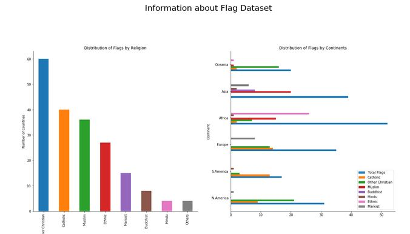

From the data, we can see that there is quite a high bias towards Christian flags. The charts also show that the other dominant flags are Christian,Catholic and Muslim. However, interestingly the Ethnic flags have a high bias in African countries. Due to the high bias, it could potential indicate an identifiable pattern that could be found among the flags despite the low amount of data collected.

Further feature exploration will be conducted to see the correlation between the features and each religion.

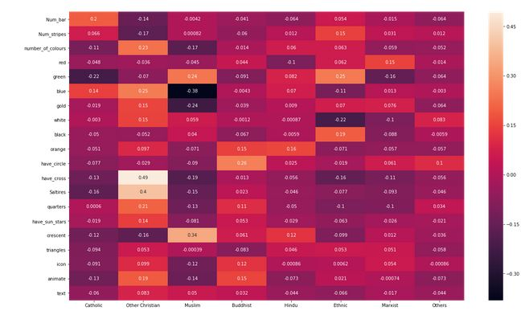

From the data, we can that certain features correlate with certain religion more than others.

1) Catholic : number of bars

2) Christian : Crosses, Saltires, quarters

3) Muslim : Crescents, Green

4) Buddhist : Circles, Orange

5) Ethnic : Green

However, due to the limited data and therefore no recognisable patterns with flags belonging to Marxist, Hindu or others, a decision was made to combine the Marxist and Hindu flags into the others category. We will then examine the data to see the identified patterns that been discoved by the exploration while also further investigating the new 'other' section to see if a pattern can be found within it.

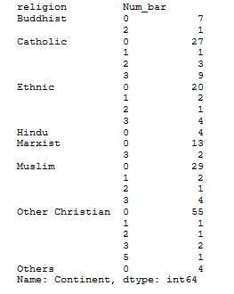

From the table above, we can that the number of bars does offer us some value in our prediction model. However, the number of bars on the flag could correlate more with its continent than its religion. As a lot of Catholic countries are in Europe and there are a lot of European flags that have 3 bars. This could be problematic as there is a high number of Catholic countries in South America, which may not have the same historic flag design as European countries.

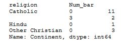

From the data above, we can see that the Number of Bar has a higher correlation with the Continent than the religion, as the majority of Cathloic countries in South America do not use bars on their flag.

The next step was to examine the correlation between the features and the religion again with the newly added section.

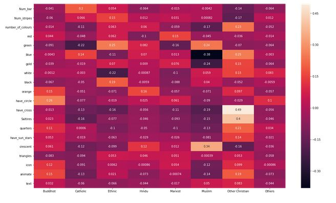

The next stage for the data is to explore the results of the data in a model and examine whether other changes can be made to the data.

<h2> Exploring the Algorithms </h2>

A range of algorithms were selected to be fitted with our data.

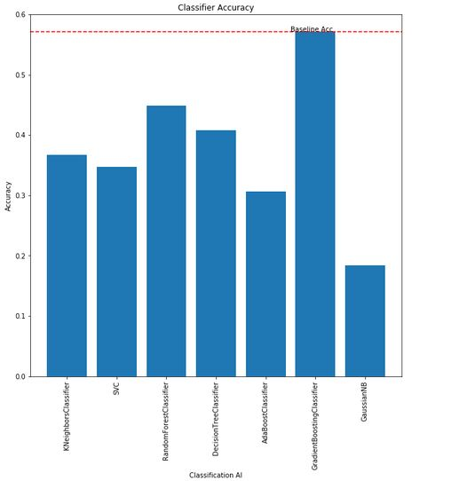

From the graph above, we can see the best performing algorithm. The results of the algorithm was then examined to see if changes could be made to the data.

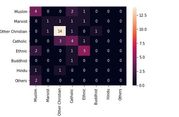

From the confusion martix, we can see that a number of issues with the model including :

1)the Buddhist's flags are being place in mulitple incorrect categories.

2) The Ethnic and Muslim Flags are being wrongly classified together.

3) The other Flags is being wrongly classified with the Muslim flags.

To try and create a more accurate model, I will add the Ethnic and Buddhist's flags into the other section.

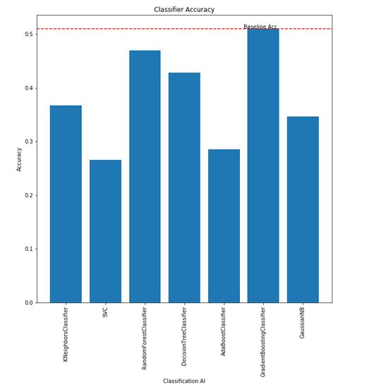
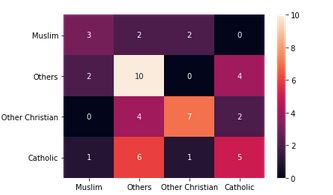

From the graph above, we can see that the simplfication of the data has not made the model more effective, as the increase other category is now making False Negatives in both the Christian and Catholic groups.

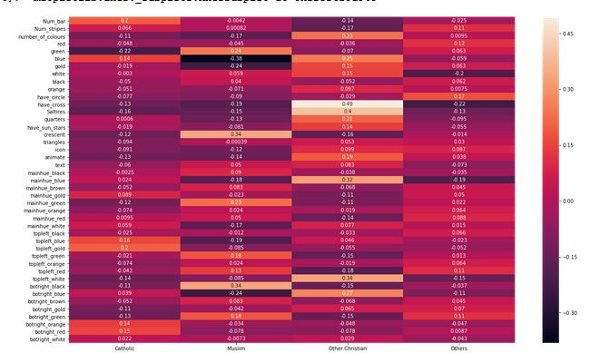

After experimenting with reducing the amount of variable that have a high correlatation between the sections : Others and Christians / Others and Catholic, the model was unable to be improved.

<h2>Optimising the Model</h2>

The next stage is to improve the model by tuning the parameters so it matches the data better.

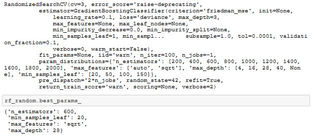
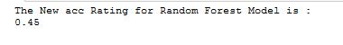

<h2>Evaluating the model </h2>

It is quite clear to see that without extra data, no effective model can be produced to meet the aims of the project. The potential routes that we can take are:

1) Get a greater sample size

2) Reduce the categories and features to a point whether there are more obvious identifiers.

